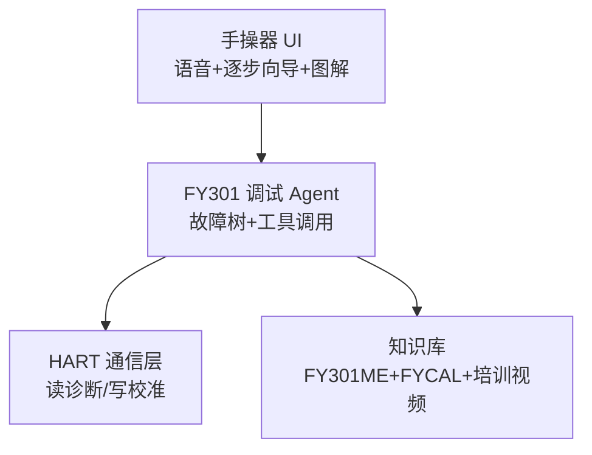

# FY301 AI 智能调试手操器

**产品代号**：`FY301-TechMate`（流衡 / SMAR 渠道可定制品牌）  
**定位**：把厂家技术员「脑子里的调试套路」装进一台能听、能问、能一步步带的现场手操器。

---

## 0. 从「昨天还在看视频」到现场手操器

昨天客户现场霍尔被带电拔掉之后，能给到的支援仍停在 **培训/仿真视频**：看完原理片，现场仍不知道先断电、再量 2–4 mm、再跑 Auto Setup。

| 阶段 | 客户拿到什么 | 现场结果 |
|------|--------------|----------|
| **昨天（视频态）** | 工程师培训版 / 原理讲解 MP4、仿真 HTML | 看懂了，仍不敢下手或下手错 |
| **今天（TechMate M0）** | 故障问答 + 逐步向导，**按故障跳到对应视频切片** | 视频变成「这一步的图解」，不是唯一交付物 |
| **明天（M1）** | 向导 + 切片 + **HART 读 Hall/压电** | 少打电话、少上门 |

原则：**视频不删，降级为切片。** 主导权交给向导（做什么 / 读什么 / 失败怎么办）。

工程师培训版已切 5 段（见 `fy301-techmate/knowledge/clips.json`）：压电 → 先导 → 滑阀 → **霍尔 2:35–3:19** → 五步排查。

---

## 1. 为什么现在做

| 现场痛点 | 传统做法 | TechMate 做法 |
|----------|----------|---------------|
| 带电拔霍尔 → HALL / 位置乱跳 | 等厂家来人 | 引导断电复位 → 查间隙 2–4 mm → Auto Setup |
| 压电电压 80 V+ / 20 V- | 猜换件 | 按手册树：先读电压 → 再决定是否 FYCAL |
| Auto Setup 报 FAIL MOVE | 电话远程猜 | 逐步查气源 / 过滤器 / 卡阀 |
| FYCAL 标定 | 只有厂家有工装 | 手操器带 **离线标定助手**（有 FYCAL 时逐步读数核对） |
| 新员工不会调 | 跟师傅学半年 | 语音 + 图解 + 仿真链接（现有 FY301 HTML/视频） |

**触发案例（真实）**：用户现场 **带电拔下霍尔传感器** → 定位器故障。  
TechMate 应第一时间问：「是否刚动过霍尔线？」→ 给 **安全恢复 SOP**，而不是泛泛聊天。

---

## 2. 产品形态

### 2.1 硬件（推荐分两档）

| 档位 | 形态 | 能力 | 目标价 |
|------|------|------|--------|
| **标准版** | 7–8" 工业平板 + HART 蓝牙/485 模块 | 读 FY301 变量、向导、知识库 | ¥2k–4k |
| **轻量版** | 手机 + 蓝牙 HART 小 dongle | 同软件，无专用壳 | ¥300–800（dongle） |

**与 SMAR 原厂手操器关系**：不替代 HART 通信协议层，而是 **在现有 HART 读写之上加 AI 向导层**（读 PV/SP/压电电压/霍尔 raw/报警码 → 解释 → 下一步）。

### 2.2 软件三层



---

## 3. 核心能力（厂家技术「可外包」清单）

### 3.1 故障诊断向导

按培训片顺序 **固定排查链**（可语音念出来）：

```
1. 信号与供电（4–20 mA、回路阻抗、极性保护）
2. 压电电压（到位后 30–70 V？）
3. 先导压力（有条件测 OUT/先导）
4. OUT1 / OUT2 压力
5. 霍尔 / 磁铁（间隙 2–4 mm、是否带电插拔）
```

**LCD/HART 报警码映射**（来自 FY301ME Auto Setup）：

| 代码 | 含义 | TechMate 首步 |
|------|------|---------------|
| **HALL** | 霍尔/磁铁问题 | 查 2–4 mm、接线、**禁止带电插拔** → 断电重启 → Auto Setup |
| **MGNT** | 磁铁未接/装错 | 查磁铁方向、阀杆连接 |
| **FAIL MOVE** | 阀不动 | 气源 20 psi+、过滤器、卡涩、双作用接管 |

### 3.2 引导式 Auto Setup

- 10 步可视化（约 4 min），每步：**做什么 / 读什么 / 失败怎么办**
- 与 HART 命令联动（若协议允许触发 Auto Setup）

### 3.3 FYCAL 压电标定助手（有工装时）

按 FY301ME §5 / 仓库 `压电陶瓷研发笔记.md`：

| 步骤 | 操作 | 合格 |
|------|------|------|
| 去迟滞 | 0→100→0 V | — |
| 调点 | 50 V，旋盔帽 | 先导 **5.8–6.2 psi** @20 psi 供气 |
| 验证 | 0 V | ≤ **2 psi** |
| 验证 | 100 V | **12–13 psi** |
| 绝缘 | 100 V / 兆欧表 | 见手册不合格阈值 |

手操器：**语音报读数 → 自动判 OK/NG → 建议清洗或换 Piezo Base**

### 3.4 预防性维护

- 压电电压趋势（30–70 V 正常，20–30 / 70–80 预警，<20 / >80 必须 FYCAL）
- 16 点行程曲线比对
- 5 个排气孔堵塞提醒（背压异常模式）

### 3.5 AI 增强（差异化）

- **自然语言**：「客户说阀位跳」「昨晚雷雨后失电」→ 匹配故障树
- **看图**：拍 LCD 报警屏 / 接线 → OCR 识别代码（P2）
- **仿真联动**：复杂原理跳转 `FY301_研发仿真工作台.html` / 培训 MP4 时间戳

---

## 4. 「带电拔霍尔」专用 SOP（示例对话）

**用户**：现场霍尔线被带电拔了，现在报警。

**TechMate**：

1. **安全**：现在不要反复插拔。让阀门处于已知安全位，通知工艺是否需切手动。  
2. **断电**：断开回路电源，等待 30 s，再上电。  
3. **目视**：霍尔连接器无 bent pin、电缆无破皮；磁铁仍在阀杆上。  
4. **间隙**：磁铁面到传感器 **2–4 mm**（用塞尺或厂家 gauge）。  
5. **HART 读数**：读 Hall raw / PV —— 手动推阀杆 10%，读数应变化。  
6. **Auto Setup**：气源正常后启动，若仍 **HALL** → 查远程传感器电缆（最长约 5 m 屏蔽线，远离动力电缆）。  
7. **仍失败**：记录报警码 + 压电电压 + 照片 →  escalation 厂家（手操器自动生成服务单）。

---

## 5. 与「流衡 AI 助手」平台关系

| 组件 | Station 工厂助手 | Pocket 挂件 | **FY301 TechMate** |
|------|------------------|-------------|---------------------|
| 语音 | ✓ | ✓ | ✓ **现场优先** |
| 知识库 | 通用工程 | 备忘 | **FY301 深** |
| HART | — | — | **✓ 必须** |
| 逐步向导 | — | — | **✓ 核心** |
| 用户 | 办公室 | 个人 | **仪表工/客户** |

**TechMate = AI助手 Core + FY301 专家 Agent + HART 硬件**

---

## 6. 里程碑

| 阶段 | 交付 | 周期感 |
|------|------|--------|
| **M0** | 故障树 FAQ + Web 向导原型（无 HART） | 2 周 |
| **M1** | 蓝牙 HART 读 FY301 变量 + 报警码解释 | 6–8 周 |
| **M2** | Auto Setup / FYCAL 逐步向导 + 服务单导出 | 3 月 |
| **M3** | 工业平板套装 + 客户试点（随 FY301 售后包） | 6 月 |

---

## 7. 商业模式（建议）

- **随定位器销售**：首批调试免费，后续年费知识库更新  
- **厂家技术降本**：减少 **60–80%** 重复性上门（HALL/MGNT/Setup 类）  
- **你们差异化**：SMAR/FY301 渠道 + 自有培训仿真资产 → **唯一有「能带调」AI 的集成商**

---

## 8. 仓库内已有资产（可直接喂给 TechMate）

| 资产 | 路径 |
|------|------|
| 压电/FYCAL 判据 | `AI研发产品/研发仿真视频/压电陶瓷研发笔记.md` |
| 排查顺序 | `旁白文案_工程师培训版.txt` |
| HALL 2–4 mm | `旁白文案_原理讲解版.txt`、仿真脚本 |
| 互动仿真 | `FY301_研发仿真工作台.html` |
| 报警码 HALL/MGNT/FAIL MOVE | `_脚本原文.txt` |
| P0 对话框架 | `AI助手/p0-demo/` |

---

## 9. 立即试用（Web 原型）

```bash
cd AI助手/fy301-techmate
python3 -m http.server 8766
# http://localhost:8766
```

见 [fy301-techmate/README.md](fy301-techmate/README.md)。
