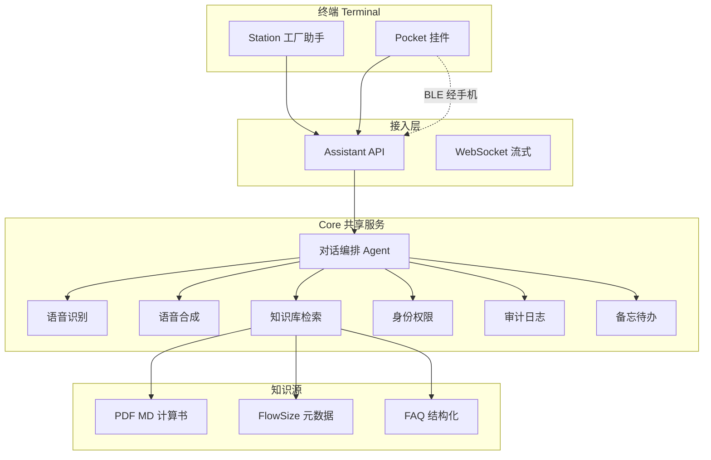
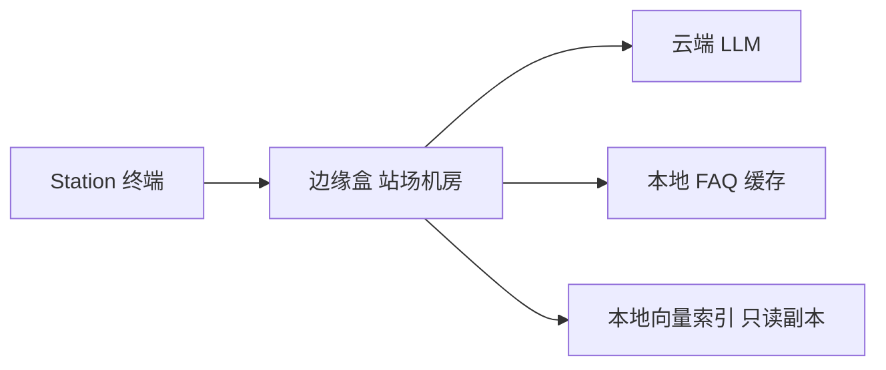
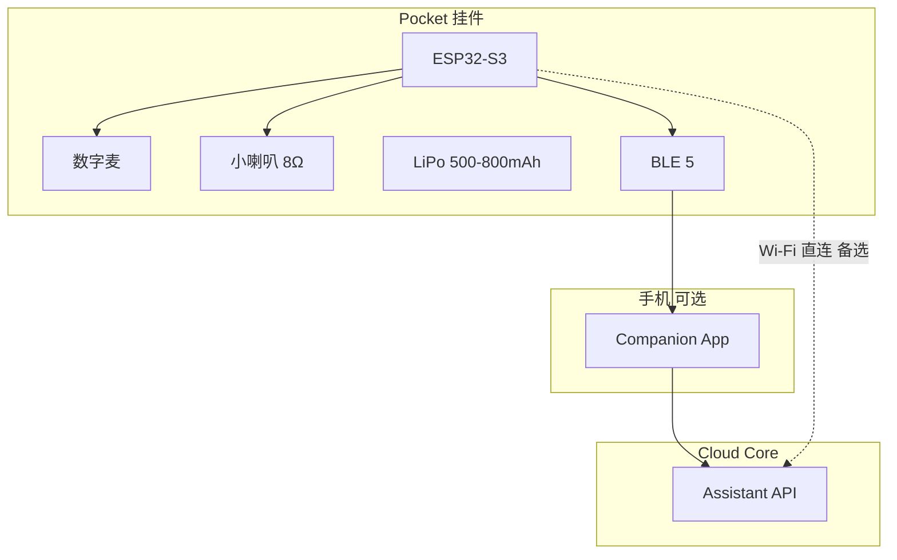

# 架构设计

## 1. 总体原则

- **一套 Core，两种 Terminal**（Station / Pocket）
- **先云后边缘**：P0–P1 云端 ASR+LLM+RAG；P2 站场加边缘盒
- **知识优先于模型**：垂直文档 RAG 是差异化，不拼通用能力

---

## 2. 逻辑架构



---

## 3. 对话编排（Agent 工具）

| 工具 | 触发示例 | 实现 |
|------|----------|------|
| `search_knowledge` | 「PH02 孔径多少」 | RAG 向量 + 关键词 |
| `get_faq` | 「FY301 压电电压范围」 | 结构化 FAQ |
| `open_flowsize` | 「帮我算孔板」 | 返回 Deep link URL |
| `create_memo` | 「记：明天发核算版」 | Pocket 优先 |
| `refuse` | 无依据时不编造 | 系统 prompt + 低分阈值 |

---

## 4. 部署拓扑

### P0–P1：纯云

```
[浏览器 / 平板 WebApp] ──HTTPS──▶ [Assistant API] ──▶ [LLM API]
                                      │
                                      └──▶ [向量库 / 文件索引]
```

### P2：站场 + 边缘



边缘盒职责：**降噪预处理、FAQ 离线、审计缓冲、弱网队列** —— 不全量私有化大模型（除非客户要求）。

---

## 5. Station 终端形态演进

| 阶段 | 硬件 | 交互 |
|------|------|------|
| P0 | PC 浏览器 | 按住说话 / 打字 |
| P1 | Android 平板 + USB 麦 | 大按钮 + 字幕 |
| P2 | reTerminal 10" 或 工业平板 | 登录 + 审计 |
| P3 | 可选对讲柱（外接功放） | 车间固定点 |

---

## 6. Pocket 终端形态



**v1 推荐**：MCU 做唤醒/录音/播放，**ASR+LLM 走手机或 Wi-Fi 云端**，降低挂件算力与发热。

---

## 7. 数据与安全

| 项 | Station | Pocket |
|----|---------|--------|
| 传输 | HTTPS / WSS | TLS |
| 存储 | 对话日志 90 天（可配置） | 默认 30 天 |
| 权限 | RBAC：文档标签 | 个人 + 公开 FAQ 子集 |
| 敏感 | 合同价、客户订单号 需角色 | 不缓存敏感回答本地 |

---

## 8. 知识库建设（与 ZL-WORK 对齐）

**第一批入库（P0 清单）**

| 路径 | 类型 |
|------|------|
| `画图/PH02_限流孔板核算结果.md` | 项目核算 |
| `变送器选型/WZDD-26-Z117_3051D选型.md` | 选型 |
| `计算软件/README.md` | 产品说明 |
| `AI研发产品/研发仿真视频/压电陶瓷研发笔记.md` | 培训 |
| `AI研发产品/研发仿真视频/README.md` | 培训 |
| `docs/公司业务一页纸.md` | 对外简介 |

**切片策略**：Markdown 按标题；PDF 按页 + OCR 后分段；每段 metadata：`project`, `tag`, `access_level`。

---

## 9. 接口草案（REST）

```
POST /v1/chat          { session_id, text, terminal: "station"|"pocket", user_id }
POST /v1/asr           multipart audio
POST /v1/tts           { text, voice_id }
POST /v1/memo          { user_id, text }          # Pocket
GET  /v1/knowledge/search?q=...
```

P0 Demo 可在前端 mock；P1 用 FastAPI / Node 实现。
